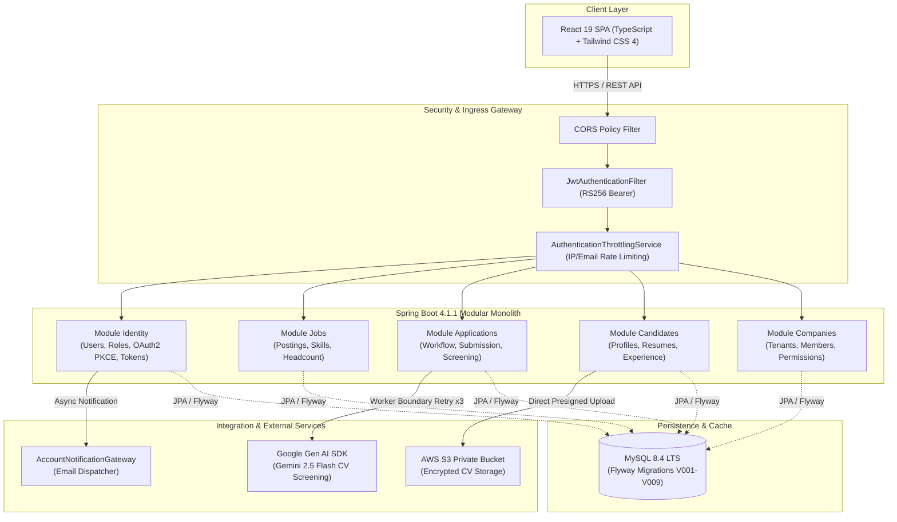

# SmartRecruit — Nền Tảng Tuyển Dụng & Sàng Lọc Thông Minh

<p align="center">
  
  
  
  
  
  
  
  
  
</p>

---

## 📌 THÔNG TIN DỰ ÁN (PROJECT INFORMATION)

* **Học phần:** Quản lý Dự án Công nghệ Thông tin (IT Project Management)
* **Đơn vị thực hiện:** **Nhóm 03**
* **Mục tiêu:** Xây dựng sản phẩm Web MVP **SmartRecruit** hỗ trợ số hóa và tối ưu hóa toàn diện quy trình tuyển dụng: từ quản lý tin tuyển dụng (Job Posting), tiếp nhận hồ sơ ứng viên (CV PDF/DOCX), trích xuất cấu trúc dữ liệu tự động bằng Google Gemini 2.5 Flash, đối chiếu tiêu chí kỹ năng minh bạch đến chuẩn bị phản hồi chuyên nghiệp cho ứng viên.

### Ràng Buộc Cốt Lõi Dự Án (Baseline Constraints)
* **Tổng ngân sách baseline:** **`33.052.000 VNĐ`**
  * *Chi phí nhân công:* `30.240.000 VNĐ` (cho 108 ngày công tiêu chuẩn).
  * *Chi phí trực tiếp hạ tầng đám mây & API:* `1.300.000 VNĐ` (AWS + Google Gen AI SDK).
  * *Quỹ dự phòng rủi ro:* `1.512.000 VNĐ` (5% Contingency Reserve).
* **Tiến độ phát triển (Timeline):** Đúng **08 Sprint** liên tục (từ **08/09/2026** đến **02/11/2026**). Cột mốc nghiệm thu kỹ thuật & UAT: **03/11/2026**.
* **Phân công đội ngũ phát triển (6 vai trò):**
  1. `Project Manager / Tech Lead`: Điều phối tiến độ, quản lý rủi ro và chất lượng kiến trúc.
  2. `Business Analyst / Product Owner`: Quản trị Product Backlog, User Stories và tiêu chí chấp nhận (Acceptance Criteria).
  3. `Backend Architect`: Thiết kế kiến trúc Modular Monolith, Domain Models, Spring Security và Flyway migrations.
  4. `Frontend UI-UX`: Xây dựng giao diện React 19 SPA (Light/Dark themes), tối ưu trải nghiệm tuyển dụng.
  5. `QA Tester`: Xây dựng Test Plans, Test Cases, kiểm thử tự động (Unit, ArchUnit, Testcontainers Integration Tests).
  6. `DevOps Cloud`: Quản lý hạ tầng AWS (EC2, RDS, S3, CloudWatch), CI/CD pipeline và môi trường Docker.

---

## 💡 NGUYÊN TẮC VẬN HÀNH & ĐẠO ĐỨC AI (ETHICS & CORE PRINCIPLES)

> [!IMPORTANT]
> **1. Human-in-the-Loop (Con người nắm quyền quyết định cuối cùng):**
> AI chỉ đóng vai trò là trợ lý ảo hỗ trợ đọc hiểu, phân tích và trích xuất thông tin. Mọi điểm số phù hợp (Score Breakdown) và khuyến nghị (Recommendation) đều được kèm theo giải thích chi tiết, minh bạch và có thể kiểm chứng. Nhà tuyển dụng (Recruiter) là người toàn quyền đưa ra quyết định mời phỏng vấn hoặc từ chối. **Tuyệt đối cấm AI tự động loại bỏ (Auto-Reject) ứng viên.**

> [!NOTE]
> **2. Admin Least Privilege (Đặc quyền quản trị tối thiểu):**
> Quản trị viên hệ thống (Platform Admin) chỉ quản lý tài khoản người dùng (Role/Status), từ điển danh mục (Taxonomy) và nhật ký kiểm toán hệ thống (Audit Logs). Admin không có quyền truy cập vào nội dung CV gốc (Raw Resume Content) hay can thiệp vào các quyết định tuyển dụng của doanh nghiệp.

> [!TIP]
> **3. Data Privacy & PII Redaction (Bảo vệ thông tin cá nhân):**
> Hệ thống tích hợp bộ lọc làm sạch dữ liệu PII (Personally Identifiable Information) trước khi gửi dữ liệu sang AI Provider, bảo toàn chính xác các mốc thời gian kinh nghiệm và học vấn nhưng ẩn danh các thông tin liên lạc nhạy cảm.

---

## 🏛️ KIẾN TRÚC HỆ THỐNG (SYSTEM ARCHITECTURE)

SmartRecruit được kiến trúc theo mô hình **Modular Monolith** kết hợp Domain-Driven Design (DDD) phân tách ranh giới rõ ràng, bảo đảm tính độc lập cao giữa các module nghiệp vụ và dễ dàng tách thành Microservices khi có nhu cầu mở rộng quy mô.



### Ranh Giới Gói & Ràng Buộc Kiến Trúc (Architectural Gates)
* **Phân lớp nội bộ:** Mỗi module nghiệp vụ tuân thủ cấu trúc 4 lớp chuẩn mực:
  * `api`: Chứa REST Controllers, Request/Response DTOs và API Exception Handlers.
  * `application`: Chứa Use Cases, Application Services, Ports và Business Commands/Queries.
  * `domain`: Chứa Domain Entities, Business Rules và Repository Interfaces.
  * `infrastructure`: Chứa Persistence Adapters, External Clients và Gateway Implementations.
* **ArchUnit Enforcement:** Hệ thống kiểm soát ranh giới mã nguồn tự động qua [ModuleArchitectureTests](file:///Users/ProM2/Documents/smart-recruitment/src/test/java/com/recruitment/app/ModuleArchitectureTests.java):
  * Lớp `api` không được phép phụ thuộc trực tiếp vào `infrastructure` (Dependency Inversion Principle).
  * Lớp `infrastructure` không được phép gọi ngược vào `api`.
  * Không giao tiếp chéo giữa các JPA Entities khác module; liên kết liên module chỉ dùng Scalar Identifiers (Foreign Keys ở tầng Database).
  * Ngân sách độ phức tạp mã nguồn (Size Budget): File mã nguồn production $\le 400$ dòng; Controller $\le 200$ dòng; Method $\le 60$ dòng; File kiểm thử $\le 600$ dòng.

---

## 🛠️ CÔNG NGHỆ SỬ DỤNG (TECHNOLOGY STACK)

| Phân Vùng | Công Nghệ / Thư Viện | Phiên Bản | Vai Trò & Tính Năng Nổi Bật |
| :--- | :--- | :---: | :--- |
| **Backend Core** | Java LTS (Amazon Corretto) | `25.0.4.1` | Nền tảng thực thi hiệu năng cao, Pattern Matching, Virtual Threads. |
| **Framework** | Spring Boot | `4.1.1` | Web MVC, Spring Data JPA, Actuator Metrics & Health Probes. |
| **Bảo mật** | Spring Security + JOSE | `6.4.x` | Xác thực JWT RS256 Asymmetric, Opaque Refresh Token, PKCE S256 OAuth2 Google. |
| **Cơ sở dữ liệu** | MySQL Server | `8.4.11 LTS` | Lưu trữ quan hệ ACID, Collation chuẩn hóa `utf8mb4_0900_ai_ci`. |
| **Migration** | Flyway Core | `11.x` | Quản lý vòng đời cấu trúc bảng (V001 đến V009 bất biến). |
| **Trí tuệ nhân tạo** | Google Gen AI SDK (Gemini) | `2.5 Flash` | Trích xuất Structured JSON CV, so khớp kỹ năng, retry 3 lần khi quá tải. |
| **Frontend Core** | React SPA | `19.0.0` | Giao diện Single Page Application hiện đại, tối ưu rendering. |
| **Ngôn ngữ UI** | TypeScript | `5.7.0` | Đảm bảo Type-safety toàn diện từ DTO contract đến UI Component. |
| **Bundler & Style** | Vite + Tailwind CSS | `8.0 / 4.0` | Lightning-fast build tool, styling utility-first linh hoạt, hỗ trợ Dark/Light Theme. |
| **Điều hướng UI** | React Router DOM | `7.18.4` | Định tuyến phía client, phân quyền theo vai trò (Role-based Guards). |
| **Kiểm thử tự động** | JUnit 5 + Mockito + ArchUnit | Latest | Kiểm thử đơn vị (Unit Test) và kiểm tra ranh giới kiến trúc tự động. |
| **Kiểm thử tích hợp** | Testcontainers | `2.0.5` | Giả lập môi trường MySQL 8.4 cô lập hoàn toàn trên Docker trong CI/CD. |
| **Hạ tầng triển khai** | Docker & AWS Cloud | Native | Đóng gói Container, AWS EC2, RDS MySQL, S3 Bucket, CloudWatch Logs. |

---

## 📊 VÒNG ĐỜI DỮ LIỆU & FLYWAY MIGRATIONS (DATABASE EVOLUTION)

Cơ sở dữ liệu được quản lý nghiêm ngặt qua 9 phiên bản migration bất biến:

| Version | Tên Migration | Mục Tiêu & Ràng Buộc Toàn Vẹn |
| :---: | :--- | :--- |
| **`V001`** | `initial_schema` | Thiết lập bảng cơ sở danh tính: `users`, `roles`, `user_roles`. |
| **`V002`** | `create_recruitment_domain_schema` | Tạo cấu trúc nghiệp vụ: `companies`, `jobs`, `job_applications`, `candidate_profiles`, `resumes`, `tokens`. |
| **`V003`** | `add_identity_authentication_schema` | Tích hợp liên kết tài khoản Google OIDC subject bindings, mã handoff code, và role `ROLE_CANDIDATE`. |
| **`V004`** | `bind_oauth_handoff_codes_to_pkce` | Ràng buộc mã chuyển giao OAuth với mã băm PKCE S256 challenge, ngăn chặn tráo đổi mã. |
| **`V005`** | `add_application_screening_audit_data` | Mở rộng lưu trữ kết quả sàng lọc CV có thể kiểm toán, cờ retryable, và khóa lease cho worker. |
| **`V006`** | `bind_oauth_handoff_codes_to_transactions` | Khóa mã xác thực OAuth theo mã giao dịch (`transaction_id`) tránh xung đột giữa các tab duyệt trình. |
| **`V007`** | `convert_job_creator_membership_to_user_references` | Chuyển đổi định danh người tạo tin tuyển dụng sang tham chiếu trực tiếp `users(id)`. |
| **`V008`** | `add_identity_credential_version_and_verification` | Bổ sung cơ chế thu hồi phiên tức thì qua `credential_version`, `email_verified`, và `email_verification_tokens`. |
| **`V009`** | `harden_schema_integrity_and_precision` | Xóa bảng Envers thừa, xóa index trùng prefix, chuẩn hóa precision `datetime(6)`, thiết lập compound FK `(company_id, created_by_user_id)` và bổ sung CHECK constraints cho tất cả enum. |

---

## 🔒 AN TOÀN THÔNG TIN & PHÒNG THỦ CHIỀU SÂU (SECURITY DEFENSE-IN-DEPTH)

1. **Quản lý Phiên & Token RS256 / SHA-256:**
   * **Access Token:** Ký số bất đối xứng RSA-256 (Private Key giữ bí mật phía server, Public Key thẩm định token). Token chứa claim `credential_version` đảm bảo thu hồi quyền lập tức khi tài khoản đổi mật khẩu, bị khóa hoặc thay đổi vai trò.
   * **Refresh Token:** Token dạng Opaque an toàn, chỉ lưu trữ mã băm SHA-256 trong Database. Hệ thống tự động phát hiện hành vi tái sử dụng token đã thu hồi (Reuse/Theft Detection) để hủy toàn bộ phiên làm việc của tài khoản.
2. **Cơ Chế Chống Quá Tải & Tấn Công Dò Quét (Multi-tier Throttling):**
   * Bảo vệ đa tầng: Giới hạn theo IP client (`ip:<ip>`), cặp IP và tài khoản (`pair:<ip>:<email>`), và tài khoản mục tiêu (`account:<email>`).
   * Cơ chế tự động dọn dẹp (Bounded Capacity with Eviction Sweep) giới hạn tối đa 10,000 mục, tự động giải phóng bộ nhớ tránh tấn công DoS cạn kiệt RAM. Trả về mã lỗi `429 TOO_MANY_REQUESTS` kèm header chuẩn `Retry-After`.
3. **Bảo Mật Đăng Nhập Google OIDC (State-of-the-art PKCE Flow):**
   * Sử dụng chuẩn OAuth 2.0 PKCE với mã băm code challenge và giao dịch liên kết theo session; không truyền Access Token hoặc JWT trực tiếp trên URL chuyển hướng trình duyệt.
4. **Bảo Vệ Tính Toàn Vẹn Cấp Cơ Sở Dữ Liệu:**
   * Ràng buộc khóa ngoại kép `fk_jobs_created_by_user_company` bảo đảm người tạo tin tuyển dụng bắt buộc phải là thành viên hợp lệ trực thuộc chính công ty đó.

---

## 🚀 HƯỚNG DẪN CÀI ĐẶT & VẬN HÀNH (GETTING STARTED)

### 1. Yêu Cầu Tiên Quyết (Prerequisites)
* **Hệ điều hành:** macOS / Linux / Windows (WSL2).
* **Docker & Docker Compose:** Docker Desktop phiên bản 24.0+ trở lên.
* **Java SDK:** OpenJDK 25 (Amazon Corretto 25 LTS).
* **Node.js:** Node.js v20.x hoặc v22.x LTS và npm v10+.

### 2. Thiết Lập Môi Trường (Environment Setup)

Clone mã nguồn về máy cục bộ:
```bash
git clone https://github.com/HipTran24/smart-recruitment-platform.git
cd smart-recruitment
```

Sao chép file mẫu biến môi trường:
```bash
cp .env.example .env
```

Tạo cặp khóa RSA 2048-bit phục vụ ký và xác thực JWT cục bộ:
```bash
./scripts/generate-local-jwt-keys.sh
```
*Script sẽ sinh ra 2 file khóa PEM và xuất ra 2 đường dẫn tuyệt đối. Hãy sao chép 2 đường dẫn này vào cấu hình `JWT_PRIVATE_KEY_FILE` và `JWT_PUBLIC_KEY_FILE` trong file `.env`.*

### 3. Khởi Chạy Nhanh Bằng Docker Compose (Toàn Bộ Hệ Thống)

Chạy kiểm tra tính đầy đủ của file biến môi trường:
```bash
./scripts/check-env.sh
```

Khởi chạy cơ sở dữ liệu MySQL 8.4 và backend Spring Boot:
```bash
./scripts/docker-up.sh
```

Kiểm tra nhật ký hoạt động (Logs):
```bash
./scripts/docker-logs.sh app
```

Kiểm tra tính sẵn sàng của hệ thống (Readiness Probe):
```bash
curl -f http://localhost:8080/actuator/health/readiness
```

Dừng toàn bộ hệ thống (dữ liệu MySQL vẫn được lưu giữ an toàn trong Docker Volume):
```bash
./scripts/docker-down.sh
```

### 4. Khởi Chạy Môi Trường Phát Triển Cho Lập Trình Viên (Developer Mode)

#### Chạy Backend Trực Tiếp Trên Máy Host:
1. Đảm bảo MySQL đang chạy (có thể dùng `./scripts/docker-up.sh` hoặc MySQL local cổng 3306).
2. Khởi chạy ứng dụng Spring Boot với Maven Wrapper:
```bash
JAVA_HOME=/path/to/corretto-25 ./scripts/run-local.sh
```
*Ứng dụng sẽ khởi động tại địa chỉ: `http://localhost:8080`.*

#### Chạy Giao Diện Frontend (React 19 SPA):
1. Chuyển vào thư mục frontend và cài đặt thư viện:
```bash
cd frontend
npm install
```
2. Khởi chạy dev server:
```bash
npm run dev
```
*Giao diện người dùng sẽ sẵn sàng tại địa chỉ: `http://localhost:5173`.*

---

## 🧪 QUY TRÌNH KIỂM THỬ & KIỂM TRA CHẤT LƯỢNG (TESTING & QA)

Dự án thiết lập quy trình kiểm chuẩn nghiêm ngặt với 85 kịch bản kiểm thử tự động, bao quát từ đơn vị đến tích hợp cơ sở dữ liệu thực.

### Chạy Toàn Bộ Bộ Kiểm Thử (Full Verification Suite)
Lệnh kiểm thử tự động khởi tạo MySQL Testcontainer cô lập, tự động áp dụng Flyway migration V001–V009 và chạy toàn bộ Unit, Integration và ArchUnit tests:

```bash
JAVA_HOME=/Users/ProM2/Library/Java/JavaVirtualMachines/amazon-corretto-25.jdk/Contents/Home ./mvnw -B -ntp clean verify
```

### Kiểm Tra Tính Độc Lập Kiến Trúc & Build Isolation
Kiểm định cổng kiến trúc ArchUnit khi chỉ định thư mục build tùy biến:

```bash
JAVA_HOME=/Users/ProM2/Library/Java/JavaVirtualMachines/amazon-corretto-25.jdk/Contents/Home ./mvnw -B -ntp -Dsmartrecruit.build.directory=/tmp/sr-verify clean verify
```

### Chạy Kiểm Thử Frontend:
```bash
cd frontend
npm run test
```

---

## 📋 TỔNG HỢP ENDPOINTS API CHÍNH (REST API SPECIFICATION)

| Phương Thức | Đường Dẫn (Endpoint) | Quyền Truy Cập | Chức Năng |
| :---: | :--- | :---: | :--- |
| `GET` | `/actuator/health/readiness` | Public | Kiểm tra tính sẵn sàng của hạ tầng & DB. |
| `GET` | `/v3/api-docs` | Public | OpenAPI 3.1.0 JSON Specification. |
| `POST` | `/api/v1/auth/register` | Public | Đăng ký tài khoản ứng viên mới. |
| `POST` | `/api/v1/auth/login` | Public | Đăng nhập bằng Email và Password, nhận cặp Token. |
| `POST` | `/api/v1/auth/refresh` | Public | Làm mới Access Token thông qua Refresh Token. |
| `POST` | `/api/v1/auth/logout` | Public | Đăng xuất và thu hồi Refresh Token tương ứng. |
| `POST` | `/api/v1/auth/oauth/exchange` | Public | Đổi mã xác thực OAuth Google với PKCE verifier lấy JWT. |
| `GET` | `/api/v1/auth/me` | Authenticated | Truy xuất thông tin định danh và vai trò người dùng hiện hành. |
| `POST` | `/api/v1/auth/password/change` | Authenticated | Đổi mật khẩu tài khoản người dùng đang đăng nhập. |
| `POST` | `/api/v1/auth/password/reset-request` | Public | Yêu cầu gửi mã token khôi phục mật khẩu qua Email. |
| `POST` | `/api/v1/auth/password/reset-confirm` | Public | Đặt mật khẩu mới thông qua Token xác nhận. |
| `POST` | `/api/v1/auth/verify-email` | Public | Kích hoạt và xác thực địa chỉ Email tài khoản. |

---

## 📚 KHO TÀI LIỆU KỸ THUẬT (DOCUMENTATION HUB)

Mọi quyết định kiến trúc, tiêu chuẩn kỹ thuật và kế hoạch khắc phục lỗi đều được lưu trữ đầy đủ tại thư mục [docs/](docs/):

* 📐 [Tổng Quan Kiến Trúc (Architecture Overview)](docs/architecture/overview.md) — Cấu trúc Modular Monolith, ranh giới gói và luồng xử lý request.
* 📋 [Kế Hoạch Khắc Phục Lỗi Kiểm Toán Backend](BACKEND_AUDIT_FIX_PLAN.md) — Báo cáo chi tiết 38+ vấn đề kiểm toán kỹ thuật từ P0 đến P3.
* 🗄️ [Sổ Tay Cơ Sở Dữ Liệu (Database Guide)](docs/database/README.md) & [Ghi Chú Schema Chi Tiết](docs/database/schema.md) — Chi tiết bảng, khóa ngoại và ràng buộc dữ liệu.
* 🔑 [API Contracts & Security Guidelines](docs/api/README.md) — Quy ước HTTP Status, định dạng lỗi và bảo mật endpoint.
* 🤖 [Runbook Xác Thực & Tích Hợp AI](docs/runbooks/authentication-and-ai.md) — Hướng dẫn chi tiết cấu hình Google OAuth và Gemini 2.5 Flash.
* ⚖️ **Architecture Decision Records (ADR):**
  * [ADR 0001: Modular Monolith Architecture](docs/adr/0001-modular-monolith.md)
  * [ADR 0002: Database Module Boundaries](docs/adr/0002-database-boundaries.md)
  * [ADR 0003: Backend MVP Baseline & Screening Rules](docs/adr/0003-backend-mvp-baseline.md)

---

## 👥 THÀNH VIÊN THỰC HIỆN (NHÓM 03)

| STT | Thành Viên | Vai Trò Chính | Trách Nhiệm Phụ Trách |
| :---: | :--- | :--- | :--- |
| 1 | **Trần Quốc Hiệp** | Project Manager / Tech Lead | Lập kế hoạch Sprint, điều phối WBS/CPM, kiểm duyệt chất lượng kỹ thuật toàn diện. |
| 2 | **Thành viên BA/PO** | BA / Product Owner | Đặc tả nghiệp vụ tuyển dụng, quản trị User Stories, Backlog & Acceptance Criteria. |
| 3 | **Thành viên Backend** | Backend Architect | Xây dựng API Spring Boot 4.1.1, phân quyền Spring Security, tối ưu hóa JPA/Hibernate. |
| 4 | **Thành viên Frontend** | Frontend UI-UX | Thiết kế giao diện React 19 SPA, xây dựng luồng ứng viên/nhà tuyển dụng, tích hợp API. |
| 5 | **Thành viên QA** | QA / Test Engineer | Thiết kế kịch bản kiểm thử, kiểm thử tự động JUnit/ArchUnit, kiểm soát chất lượng code. |
| 6 | **Thành viên DevOps** | DevOps Cloud Engineer | Thiết lập Docker Compose, pipeline CI/CD, hạ tầng đám mây AWS và giám sát hệ thống. |

---

<p align="center">
  <i>Đồ án môn học Quản lý Dự án Công nghệ Thông tin — Học kỳ 1 (2026–2027)</i><br/>
  <b>SmartRecruit Platform • Nhóm 03</b>
</p>
