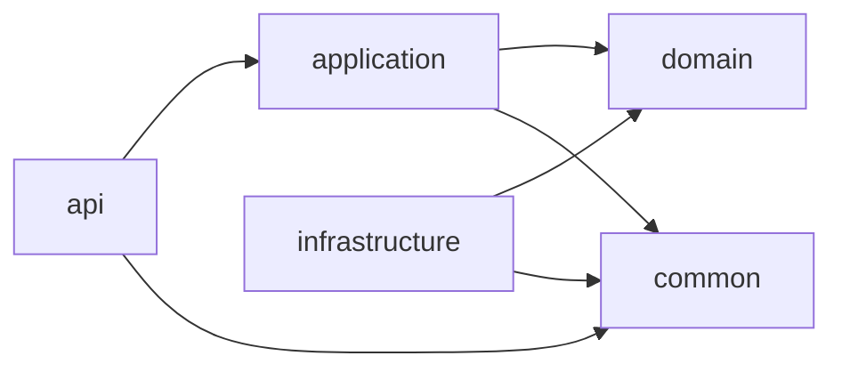

# Kiến trúc Backend

> Trạng thái: **Current baseline + target structure**. Backend là một Spring Boot application tại repository root. Identity có API/application/security riêng; Gemini là adapter của module applications.

## Công nghệ hiện có

| Thành phần | Công nghệ |
| --- | --- |
| Ngôn ngữ và build | Java, Maven |
| Framework | Spring Boot |
| Web | Spring Web MVC |
| Persistence | Spring Data JPA / Hibernate |
| Database | MySQL Connector/J |
| Migration | Flyway |
| HTTP baseline | Spring Security, Validation, Actuator |
| Integration test | Testcontainers MySQL |
| Boilerplate | Lombok |

Entry point hiện tại là `com.recruitment.app.Application`. Package gốc của backend là `com.recruitment.app`.

## Nguyên tắc tổ chức

Backend tổ chức theo **feature/module trước, technical layer sau**. Ví dụ, code liên quan đến tin tuyển dụng nằm trong `modules/jobs/`, thay vì trải qua các thư mục toàn cục `controller/`, `service/` và `repository/`.

```text
com/recruitment/app/
├── Application.java
├── common/
│   ├── api/error/
│   ├── infrastructure/persistence/
│   └── security/                 # CORS và primitive dùng chung
└── modules/
    ├── identity/
    │   ├── api/
    │   ├── application/
    │   └── infrastructure/{persistence,security}/
    ├── candidates/infrastructure/persistence/entity/
    ├── companies/infrastructure/persistence/entity/
    ├── jobs/infrastructure/persistence/entity/
    └── applications/
        ├── application/screening/
        └── infrastructure/{persistence,integration}/
```

`common/` chỉ được dùng cho mã thật sự dùng chung giữa nhiều module. Không tạo `utils/` làm nơi chứa các hàm không có chủ sở hữu rõ ràng.

## Cấu trúc một module

```text
modules/jobs/
├── api/
│   ├── JobController.java
│   ├── request/
│   └── response/
├── application/
│   ├── JobService.java
│   ├── command/
│   ├── query/
│   └── mapper/
├── domain/
│   ├── model/
│   ├── repository/
│   ├── event/
│   └── exception/
└── infrastructure/
    ├── persistence/
    ├── integration/
    └── scheduler/
```

| Lớp | Trách nhiệm | Không được làm |
| --- | --- | --- |
| `api` | HTTP, validate DTO, status code, trả response | Chứa business logic hoặc SQL |
| `application` | Điều phối use case, transaction, mapping | Phụ thuộc vào HTTP request/response |
| `domain` | Quy tắc nghiệp vụ, model, contract | Phụ thuộc framework web hoặc database cụ thể |
| `infrastructure` | JPA, MySQL, email, storage, dịch vụ ngoài | Quyết định business rule |

## Luồng phụ thuộc



`infrastructure` hiện thực các interface mà `domain`/`application` cần. Module không truy cập trực tiếp entity hoặc repository nội bộ của module khác; giao tiếp qua use case công khai hoặc event đã thống nhất. Trong JPA persistence model, reference sang module khác là scalar ID; foreign key được khai báo trong Flyway thay vì quan hệ object JPA xuyên module.

## Quy tắc triển khai

- Controller nhận request DTO và trả response DTO; không trả JPA entity trực tiếp.
- Validation đầu vào đặt ở request DTO; rule nghiệp vụ đặt ở domain/application.
- Transaction mở tại application service, không mở trong controller.
- Ngoại lệ HTTP dùng response chung ở `common/api`, nhưng mapping lỗi nghiệp vụ nằm trong API module sở hữu nó.
- Khi tích hợp email, object storage hoặc dịch vụ ngoài, tạo adapter trong `infrastructure/integration`.
- Chỉ tạo package khi có class thực tế. Git không theo dõi thư mục trống.
- Không đặt Jackson annotation trên JPA entity. API chỉ serialize request/response DTO.
- Bất kỳ endpoint mới nào phải được mở tường minh trong `IdentitySecurityConfiguration`; mặc định hiện tại là deny-all, ngoại trừ health/info và identity routes được contract hóa.
- JWT infrastructure dùng key RSA ở runtime secret store; refresh token chỉ lưu SHA-256 digest trong database. Google provider token không được lưu bởi ứng dụng.
- `CvScreeningGateway` là application port; Gemini adapter có thể thay thế/disable mà không làm application layer phụ thuộc provider.
