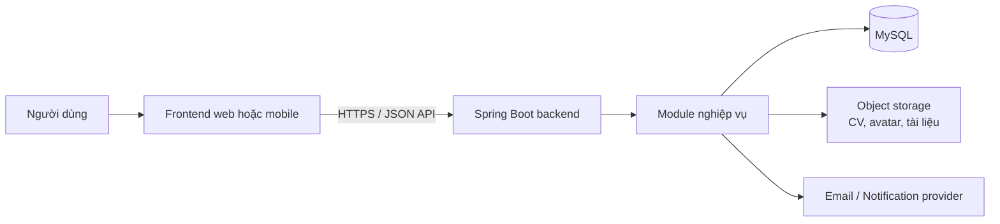
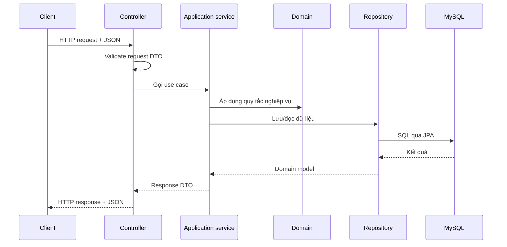

# Kiến trúc Smart Recruitment

> Target decisions: [ADR 0003](../adr/0003-backend-mvp-baseline.md). Historical company persistence remains until G1 migration; it is not the target authorization boundary. See [implementation status](../architecture/implementation-backlog.md).

> Trạng thái: **Current baseline**. Tài liệu mô tả phần đang có và các ranh giới bắt buộc cho mã mới.

## 1. Mục tiêu

Smart Recruitment được tổ chức như một **modular monolith**: một ứng dụng Spring Boot được triển khai độc lập, nhưng mã nguồn được chia theo từng miền nghiệp vụ. Cách này phù hợp với giai đoạn đầu của sản phẩm vì đơn giản để phát triển và triển khai, đồng thời tránh việc các module nghiệp vụ bị trộn lẫn khi hệ thống mở rộng.

Các mục tiêu chính:

- Tách mã theo nghiệp vụ tuyển dụng thay vì gom toàn bộ controller, service và repository vào các thư mục lớn dùng chung.
- Giữ API, database migration, cấu hình và tài liệu ở vị trí xác định.
- Không đưa mật khẩu, token, file build hay file người dùng tải lên vào Git.
- Có thể mở rộng thêm frontend, cache, hàng đợi hoặc dịch vụ riêng trong tương lai mà không phải tổ chức lại toàn bộ repository.

## 2. Trạng thái hiện tại

Repository hiện là một ứng dụng Spring Boot/Maven tại thư mục gốc:

- Entry point: `src/main/java/com/recruitment/app/Application.java`.
- Maven artifact: `com.recruitment:application`.
- Công nghệ đã có: Spring Web MVC, Spring Data JPA, MySQL Connector/J và Lombok.
- Cấu hình ứng dụng nằm tại `src/main/resources/application.yml`.
- Có persistence entity và Flyway migration cho identity, candidate, company, job và application.
- Đã có API identity; chưa có API nghiệp vụ tuyển dụng công khai. HTTP mở health/info và auth routes; mọi endpoint mới mặc định bị từ chối cho đến khi có authentication, authorization và API contract.
- CI tạo MySQL tạm thời bằng Testcontainers để chạy migration và Hibernate schema validation.

## 3. Bức tranh tổng thể



Backend là nguồn xử lý nghiệp vụ và kiểm soát truy cập. MySQL chỉ lưu dữ liệu có cấu trúc cùng metadata file; CV, avatar và tài liệu không được lưu trong repository hoặc thư mục `uploads/` của source code.

## 4. Cấu trúc repository đích

```text
smart-recruitment/
├── .github/                         # CI, PR template, issue template, CODEOWNERS
├── docs/                            # Tài liệu được version bằng Git
│   ├── architecture/                # Kiến trúc và các sơ đồ
│   ├── api/                         # API contract và OpenAPI
│   ├── database/                    # ERD, data dictionary, quy ước SQL
│   ├── adr/                         # Architecture Decision Records
│   └── runbooks/                    # Cách chạy, deploy và xử lý sự cố
├── infra/                           # Docker và hạ tầng triển khai
│   └── docker/
├── scripts/                         # Script hỗ trợ local/CI, không có secret
├── src/                             # Spring Boot backend hiện tại
├── pom.xml
├── mvnw
├── mvnw.cmd
├── .editorconfig
├── .gitignore
├── .env.example                     # Chỉ tên biến môi trường, không có giá trị thật
├── README.md
├── CONTRIBUTING.md
└── SECURITY.md
```

Không tạo thư mục `backend/` ở giai đoạn này: repository hiện tại đã là backend Spring Boot. Một thư mục `frontend/` chỉ được thêm khi đội đã chọn công nghệ và bắt đầu xây giao diện.

## 5. Cấu trúc package backend

Package gốc giữ là `com.recruitment.app`. Persistence model hiện có được tổ chức theo module như sau:

```text
src/main/java/com/recruitment/app/
├── Application.java
├── common/
│   ├── infrastructure/persistence/  # BaseEntity dùng chung cho JPA
│   └── security/                    # HTTP security baseline và password encoder
└── modules/
    ├── identity/
    ├── candidates/
    ├── companies/
    ├── jobs/
    ├── applications/
    ├── interviews/
    ├── notifications/
    └── files/
```

Khi một module có API/use case, nó dùng thêm các ranh giới sau:

```text
modules/jobs/
├── api/                             # Controller, request và response DTO
├── application/                     # Use case, service, command/query, mapper
├── domain/                          # Model, rule nghiệp vụ, repository interface
└── infrastructure/
    └── persistence/entity/           # JPA entity, không import entity module khác
```

Quy tắc phụ thuộc:

- `api` gọi `application`; không gọi trực tiếp JPA repository.
- `application` điều phối use case và phụ thuộc vào abstraction ở `domain`.
- `infrastructure` hiện thực persistence hoặc tích hợp bên ngoài.
- `common` chỉ chứa phần dùng thật sự chung; không dùng nó như một thư mục `utils` để chứa mọi thứ.
- Một module không truy cập entity/repository nội bộ của module khác. Các liên kết persistence xuyên module dùng scalar ID; database FK bảo toàn referential integrity. Test kiến trúc kiểm tra quy tắc này trong CI.

## 6. Dòng chảy một request



Controller không được trả JPA entity trực tiếp ra API. Request/response DTO giúp API ổn định khi model database thay đổi.

## 7. Database và cấu hình

```text
src/main/resources/
├── application.yml                  # Không có credential; đọc datasource từ environment
├── application-local.yml.example    # Mẫu cấu hình local
├── application-test.yml             # Cấu hình test
└── db/migration/                    # Flyway migration
    ├── V001__initial_schema.sql
    └── V002__create_recruitment_domain_schema.sql
```

Nguyên tắc:

- Mỗi thay đổi schema là một migration SQL mới, có version tăng dần.
- Không sửa migration đã chạy ở môi trường chung.
- Production và shared environment không dùng `ddl-auto: create` hoặc `ddl-auto: update`.
- Password database, JWT secret và API key đến từ biến môi trường hoặc secret manager; không commit vào YAML.
- Instant được ghi theo UTC: MySQL session và Hibernate JDBC timezone đều đặt UTC.
- File build trong `target/` không phải nguồn cấu hình và không được commit.

## 8. Kiểm thử

```text
src/test/
├── java/com/recruitment/app/
│   ├── unit/                        # Test rule/use case không cần database thật
│   ├── integration/                 # Test Spring + persistence/API
│   └── support/                     # Fixture và test helper
└── resources/
    └── application-test.yml
```

Unit test chạy nhanh và không phụ thuộc hạ tầng. Integration test dùng MySQL Testcontainers, kiểm tra Flyway và Hibernate `validate` trên database trống; không chạm vào MySQL local của developer.

## 9. Quy ước làm việc

- Một Pull Request chỉ tập trung vào một mục tiêu rõ ràng.
- Tên nhánh: `feature/<ticket>-<ten>`, `fix/<ticket>-<ten>`, `docs/<ticket>-<ten>` hoặc `chore/<ticket>-<ten>`.
- Commit dùng dạng `feat(jobs): ...`, `fix(auth): ...`, `docs(architecture): ...`.
- `main` chỉ nhận thay đổi thông qua Pull Request đã được review và CI kiểm tra.
- Không commit `.idea/`, `target/`, `.env`, `application-local.yml`, log hoặc file người dùng tải lên.

## 10. Phạm vi của tài liệu này

Tài liệu này là bản đồ cấu trúc. Chi tiết API sẽ được đặt trong `docs/api/`, chi tiết database trong `docs/database/`, còn mỗi quyết định quan trọng sẽ được ghi thành một file riêng trong `docs/adr/`.
